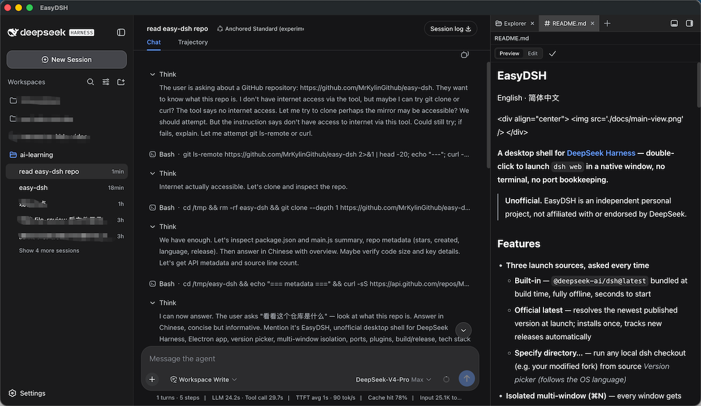
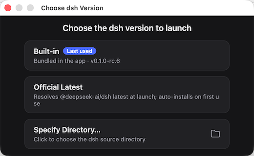

# EasyDSH
English · [简体中文](README.zh.md)

<div align="center">

</div>

**A desktop shell for [DeepSeek Harness](https://github.com/deepseek-ai/deepseek-harness) — double-click to launch `dsh web` in a native window, no terminal, no port bookkeeping.**


> **Unofficial.** EasyDSH is an independent personal project, not affiliated with or endorsed by DeepSeek.

## Features
- **Three launch sources, asked every time**
  - **Built-in** — `@deepseek-ai/dsh@latest` bundled at build time, fully offline, seconds to start
  - **Official latest** — resolves the newest published version at launch; installs once, tracks new releases automatically
  - **Specify directory…** — run any local dsh checkout (e.g. your modified fork) from source
  
- **Isolated multi-window (⌘N)** — every window gets its own dsh process and its own port, all sharing one `~/.dsh`: sessions, keys, settings and plugins are visible everywhere; close a window and its process is reclaimed.
- **Always its own port** — never attaches to a running dsh. Scans upward (+1, +2…) from the preferred port (3081 by default), so the selected version is exactly what the window shows.
- **Menu follows dsh** — app menu language tracks dsh's `locale.preference`; window title bar follows the UI theme; the version picker follows the OS language.
- **No Node/pnpm required** — shims are generated under `~/.dsh/desktop-bin/`; built-in/latest run on Electron's bundled Node, source runs prefer a system Node that satisfies dsh's engines.
- **Copy & paste everywhere** — standard Edit menu plus right-click clipboard menu.
- **Friendly error window** — fixed-size, scrollable, with a working close button even for the longest stack traces.

## Download

Packaged builds are published on the [Releases](https://github.com/MrKylinGithub/easy-dsh/releases) page:

| Platform | Asset |
| --- | --- |
| macOS (Apple Silicon) | `EasyDSH-0.1.0-arm64.dmg` |
| Windows (x64) | *coming soon* |

First launch on macOS: right-click → Open (unsigned build).

## How it works

```
Window A ── dsh process A ── port 3081 ─┐
Window B ── dsh process B ── port 3082 ─┼─ one shared ~/.dsh
Window C ── dsh process C ── port 3083 ─┘
```

1. Launch → the version picker asks which source to use (the previous choice is marked "Last used"; an explicit `--dsh <choice>` skips it).
2. The app picks the first bindable port from the preferred one upward.
3. Each window owns its dsh process; quitting reclaims every process the app started. Your terminal dsh is never touched.

## Build from source

```sh
git clone https://github.com/MrKylinGithub/easy-dsh.git
cd easy-dsh
npm install        # first time
npm start          # dev run

npm run dist:mac   # macOS → dist/EasyDSH-0.1.0-arm64.dmg
npm run dist:win   # Windows → needs wine or a Windows machine
npm run dist       # both
```

`scripts/build.mjs` pins downloads to npmmirror mirrors and auto-downloads the
electron-builder icons toolset (sha256-verified), so builds do not stall on
GitHub downloads.

**Releases**: pushing a `v*` tag triggers GitHub Actions
(`.github/workflows/release.yml`) to build macOS (x64 + arm64) and Windows
(x64) installers and publish them with SHA-256 checksums.

CLI overrides (`npm start -- --port 8080`):

| Flag | Meaning |
| --- | --- |
| `--dsh <choice>` | `builtin` / `latest` / `dir:<path>` — skips the picker |
| `--host <ip>` | bind host (default 127.0.0.1) |
| `--port <n>` | preferred port (default 3081) |
| `--keep-server` | leave servers running on quit |
| `--devtools` | open DevTools per window |

## Configuration

First run generates `~/.dsh/desktop.json`:

```json
{
  "repo": "/path/to/deepseek-harness",
  "host": "127.0.0.1",
  "port": 3081,
  "keepServerOnQuit": false,
  "dshSource": "dir:/path/to/deepseek-harness"
}
```

- The official sources install `@deepseek-ai/dsh@<version>` into
  `~/.dsh/desktop-versions/dsh-<version>/` (npmmirror) on first use.
- Logs: `~/.dsh/desktop.log` (shell), `~/.dsh/desktop-server.log` (dsh web).

## Bundled plugins

EasyDSH seeds the shared web profile with a curated plugin set on first run
(`bundled-plugins/manifest.json` — registry versions or tarballs shipped
inside the app):

- [dsh-file-review](https://github.com/left0ver/dsh-file-review) — diff panel
  for reviewing and reverting agent file changes
- [ModLens](https://github.com/liustack/modlens) (`@liustack/modlens`) —
  plug-in vision for text-only models: paste an image and it is read through
  a multimodal engine, no file round-trip

Each plugin missing from the profile's bundle layer is installed via pnpm
(through `npm exec`, no global pnpm needed) and appended to
`dsh.profile.bundles`; existing plugins are left untouched, so the step is a
fast no-op afterwards. To add your own: drop a tarball (or a registry
`name@version`) into `bundled-plugins/manifest.json` and rebuild.

## Plugin compatibility

EasyDSH shares one `~/.dsh` with your terminal dsh. Out-of-tree profile
plugins resolve `@deepseek-ai/*` packages from the **host installation** —
declare them as `peerDependencies` (e.g. `">=0.1.0-rc.5 <0.2.0"`) and install
the plugin as an npm tarball, never as a directory `link:`. Bundling your own
dsh copies breaks this contract.

## Security

This repository contains **no keys**. Your API credentials live in
`~/.dsh/.credentials.yaml`, managed by dsh itself. `~/.dsh/desktop.json`
holds only paths and ports; runtime logs stay local.

## Layout

```
easy-dsh/
  src/main.js      # Electron main: picker, servers, windows, theme/locale sync
  scripts/build.mjs# packaging entry: mirrors + icons toolset auto-download
  docs/            # screenshots used by the README
  build/           # app icon sources (icon.svg → icon.png)
  builtin-dsh/     # bundled @deepseek-ai/dsh (built at dist time, gitignored)
  package.json     # electron-builder config (mac dmg / win nsis), asar:false
```

## License

[MIT](LICENSE). The app icon uses the DeepSeek logo mark from the
MIT-licensed [deepseek-harness](https://github.com/deepseek-ai/deepseek-harness)
repository; EasyDSH itself is not a DeepSeek product.
